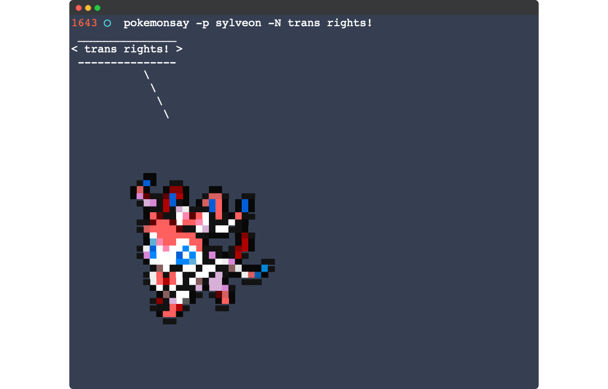

pokemonsay
==========



`pokemonsay` is [cowsay](https://en.wikipedia.org/wiki/Cowsay) but for Pokémon! Internally `pokemonsay` still uses `cowsay` so you will need it installed as well.

## Installation

### macOS

You can install `pokemonsay` through Homebrew.

```sh
# If you do not already have Homebrew installed
/bin/bash -c "$(curl -fsSL https://raw.githubusercontent.com/Homebrew/install/HEAD/install.sh)"
# To use gshuf (required)
$ brew install coreutils
# Install cowsay (required)
$ brew install cowsay
# To use random sayings (optional)
$ brew install fortune
# Allow homebrew to install from this repo
$ brew tap anthonyvadala/anthonyvadala
# Install pokemonsay
$ brew install pokemonsay
```

### Debian/Ubuntu

```sh
$ git clone http://github.com/anthonyvadala/pokemonsay
$ cd pokemonsay
$ ./install.sh
```

## Usage

Now that `pokemonsay` is installed, you can use it like so:

```bash
$ pokemonsay Hello World
```

To have a random Pokémon say some random thing to you, use `fortune`:

```bash
$ fortune | pokemonsay
```

There is a cowthink-like version as well:

```bash
$ pokemonthink --pokemon Charmander "One day I will be a Charizard!"
```

## Options

	```bash
	-p, --pokemon POKEMON_NAME
		Choose what Pokémon will be used by its name.
	-f, --file COW_FILE
		Specify which .cow file should be used.
	-W, --word-wrap COLUMN
		Specify roughly where messages should be wrapped.
	 -l, --list
		List all the Pokémon available.
	-N, --no-name
		Do not tell the Pokémon name.
	-t, --think
		Make the Pokémon think the message, instead of saying it.
	-h, --help
		Display this usage message.
	MESSAGE
		What the Pokémon will say. If you don\'t provide a message, a message will be read form standard input.
	```
## Known Issues

- When trying to call a Pokémon that has one or more variants you must specify `[Pokémon name]_[dex number][variant letter]`, you can get a full listing of Pokémon with this information by using `pokemonsay -l`.

## Uninstall

```bash
$ brew uninstall pokemonsay
```

## Special Thanks

A special thanks to [@possatti](https://github.com/possatti) for creating the original pokemonsay.

## NOTICE

I don't own Pokémon or anything related to it. Pokémon is property of [The Pokémon Company](https://www.pokemon.com/us/legal/).
