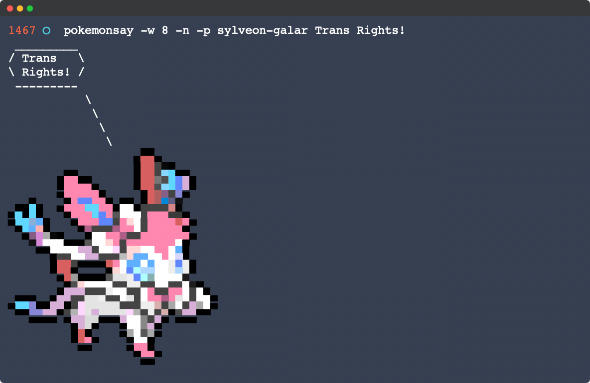

pokemonsay
==========



`pokemonsay` is [cowsay](https://en.wikipedia.org/wiki/Cowsay) but for Pokémon! Internally `pokemonsay` still uses `cowsay` so you will need it installed as well.

## Installation

### macOS

You can install `pokemonsay` through Homebrew.

```sh
# If you do not already have Homebrew installed
/bin/bash -c "$(curl -fsSL https://raw.githubusercontent.com/Homebrew/install/HEAD/install.sh)"
# To use gshuf (required)
brew install coreutils
# Install cowsay (required)
brew install cowsay
# To use random sayings (optional)
brew install fortune
# Allow homebrew to install from this repo
brew tap anthonyvadala/anthonyvadala
# Install pokemonsay
brew install pokemonsay
```

### Linux

```sh
git clone http://github.com/anthonyvadala/pokemonsay
cd pokemonsay
./install.sh
```

## Usage

Now that `pokemonsay` is installed, you can use it like so:

```sh
pokemonsay Hello World
```

To have a random Pokémon say some random thing to you, use `fortune`:

```sh
fortune | pokemonsay
```

There is a cowthink-like version as well:

```sh
pokemonthink -p Charmander-Kanto One day I will be a Charizard!
```

## Options

```sh
-p, --pokemon POKEMON_NAME-REGIONIAL_VERSION
	Choose what Pokémon and regional version will be used by its name and region.
-f, --file COW_FILE
	Specify which .cow file should be used.
-w, --word-wrap COLUMN
	Specify roughly where messages should be wrapped.
 -l, --list
	List all the Pokémon available.
-n, --no-name
	Do not show the Pokémon name.
-t, --think
	Make the Pokémon think the message, instead of saying it.
-h, --help
	Display this usage message.
MESSAGE
	What the Pokémon will say. If you don\'t provide a message, a message will be read form standard input.
```

## Uninstall

### macOS
```sh
brew uninstall pokemonsay
```

### Linux
```sh
sh $HOME/.pokemonsay/uninstall.sh
```

## Known Issues

- When trying to call a Pokémon you must specify its region as well e.g.`[Pokémon Name]-[Region]`, you can get a full listing of Pokémon and their regions by using `pokemonsay -l`.

## Build Instructions

See the `README.md` file in the `/build` folder for instructions

## Special Thanks

A special thanks to [@possatti](https://github.com/possatti) for creating the original pokemonsay.

## NOTICE

I don't own Pokémon or anything related to it. Pokémon is property of [The Pokémon Company](https://www.pokemon.com/us/legal/).
